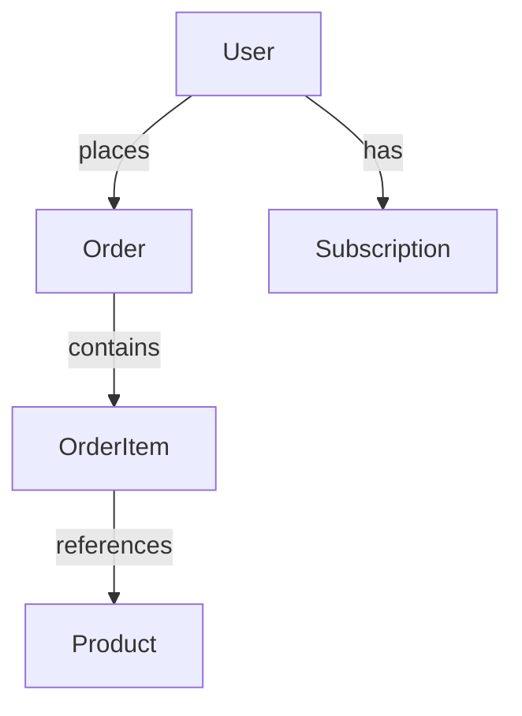

# Test Data Structure Documentation

## Overview

This test data set is designed to test all major features of the EntitySmith knowledge graph application, including:

- Source registration and profiling
- Connection proposal generation (FK detection, heuristic matching, embedding similarity)
- Entity consolidation and merging
- Identity resolution and conflict handling
- Unstructured data enrichment
- RDF export functionality

## Data Relationships

### Entity Types and Relationships

### Cross-Source Entity Mapping

The test data includes intentional overlaps between sources for testing merge functionality:

- **users.csv** (CSV) ↔ **customers.json** (JSON) ↔ **customers table in products.db** (SQLite)
  - All represent the same conceptual entity (User/Customer)
  - Same email addresses across sources
  - Different attribute names and structures

- **products.csv** (inferred from order_items) ↔ **products.json** ↔ **products table in products.db**
  - Same products with different IDs and formats
  - Price variations for conflict resolution testing

## Structured Data Sources

### CSV Files (`testData/structured/csv/`)

1. **users.csv**
   - 10 user records
   - Fields: id, name, email, created_at, country, plan_id
   - Clean data for baseline testing

2. **users_with_duplicates.csv**
   - 13 records (10 unique + 3 duplicates)
   - Intentional duplicates for deduplication testing
   - Variations: exact duplicates, name variations, email format differences

3. **orders.csv**
   - 10 order records
   - Foreign key: user_id → users.id
   - Fields: order_id, user_id, order_date, total_amount, status

4. **order_items.csv**
   - 11 order item records
   - Foreign keys: order_id → orders.order_id, product_id → products
   - Fields: order_item_id, order_id, product_id, quantity, unit_price

### JSON Files (`testData/structured/json/`)

1. **customers.json**
   - 5 customer records (overlaps with users.csv)
   - Different structure: customer_id, name, email, join_date, country, membership_level
   - Same emails as users.csv for merge testing

2. **products.json**
   - 5 product records
   - Nested structure with "products" array
   - Different IDs than CSV (PROD-XXX vs PXXX)

### SQLite Database (`testData/structured/sqlite/products.db`)

**Tables:**

1. **products**
   - id (TEXT, PK), name, description, price, category, stock_quantity
   - 5 product records (P001-P005)
   - Matches products in other formats

2. **customers**
   - cust_id (INTEGER, PK), full_name, email, signup_date, region, tier
   - 5 customer records (overlaps with CSV/JSON)
   - Same emails for cross-source matching

## Unstructured Data Sources

### Markdown Files (`testData/unstructured/markdown/`)

1. **product_documentation.md**
   - Comprehensive product documentation
   - Contains entity references: Product IDs (P001-P005, PROD-001-PROD-005)
   - Describes relationships between entities
   - Includes mermaid diagram of data model
   - Mentions customer tiers and order statuses

2. **meeting_notes.md**
   - Team meeting notes with dates
   - Contains person references with emails (alice@ex.com, bob@ex.com, etc.)
   - Mentions specific products (Gadget Pro PROD-004)
   - References specific orders (ORD-005, ORD-009)
   - Discusses customer tiers and relationships

## Expected Output

### Schema Output (`expected_output/expected_schema.ttl`)

- RDF Schema defining classes and properties
- Entity types: User, Product, Order, OrderItem
- Relationships: places, contains, references
- Attributes with proper data types

### Instance Output (`expected_output/expected_instances_sample.ttl`)

- Sample RDF instances showing expected structure
- Users with names and emails
- Products with attributes
- Orders with dates and amounts
- Relationships between entities

## Test Scenarios

### 1. Source Registration
- Test CSV, JSON, and SQLite source registration
- Verify schema extraction and profiling
- Check sample data preview functionality

### 2. Connection Proposal Generation
- **FK Detection**: orders.user_id → users.id
- **Heuristic Matching**: Similar column names across sources
- **Embedding Similarity**: Semantic matching of entity descriptions
- **Cross-Source**: users.email ↔ customers.email

### 3. Entity Consolidation
- **Merge Testing**: users.csv + customers.json + customers table
- **Link Testing**: Different but related entity types
- **Subtype Testing**: Customer tiers (basic, premium, enterprise)

### 4. Identity Resolution
- **Deduplication**: users_with_duplicates.csv
- **Conflict Resolution**: Price differences between product sources
- **URI Minting**: Test different strategies

### 5. Unstructured Enrichment
- **Entity Extraction**: Products, customers from markdown
- **Relationship Extraction**: Customer-order relationships
- **Evidence Quoting**: Verify source references are preserved

### 6. RDF Export
- **Schema Export**: Validate class and property definitions
- **Instance Export**: Verify proper URI generation
- **Data Type Handling**: Check xsd:date, xsd:decimal, etc.
- **Relationship Export**: Confirm proper predicate usage

## Data Quality Issues (Intentional)

1. **Duplicate Records**: users_with_duplicates.csv
   - Exact duplicates (same ID, same data)
   - Fuzzy duplicates (same email, different names)
   - Format variations (different email cases)

2. **Missing Values**: Various fields left empty for null handling testing

3. **Inconsistent Formatting**:
   - Date formats (YYYY-MM-DD vs other formats)
   - Name formats ("Bob Johnson" vs "Bob K. Johnson")
   - ID formats (P001 vs PROD-001)

4. **Cross-Source Conflicts**:
   - Different attribute names for same concept
   - Price variations for same products
   - Different tier naming (plan_id vs membership_level)

## Usage Recommendations

1. **Start Small**: Begin with 1-2 sources, then add more
2. **Test Merges**: Use the overlapping user/customer data to test consolidation
3. **Validate Relationships**: Check that FK detection works across formats
4. **Test Enrichment**: Process markdown files to extract additional entities
5. **Export Validation**: Compare output with expected Turtle files

This test data set provides comprehensive coverage of EntitySmith's functionality while maintaining a manageable size for development and testing.