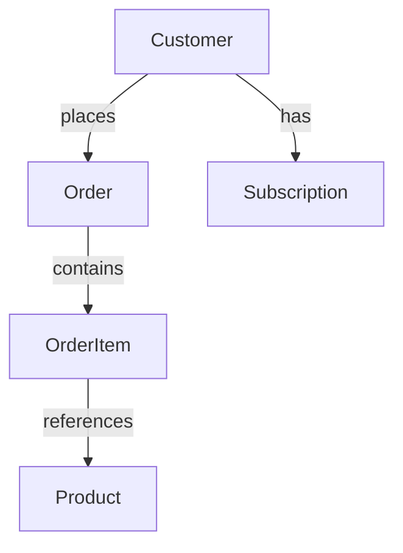

# Product Documentation

## Overview

Our product lineup consists of two main categories: Widgets and Gadgets. Each category serves different customer needs and use cases.

## Widgets

### Basic Widget
- **Product ID**: P001
- **Description**: A basic widget designed for everyday use
- **Best for**: Beginners and casual users
- **Key features**: Simple interface, reliable performance
- **Price range**: $40-$60

### Advanced Widget  
- **Product ID**: P002
- **Description**: An advanced widget with additional features
- **Best for**: Power users and small businesses
- **Key features**: Extended functionality, customizable settings
- **Price range**: $60-$80

### Premium Widget
- **Product ID**: P003
- **Description**: Our top-of-the-line widget with all features enabled
- **Best for**: Enterprise customers and professionals
- **Key features**: Full feature set, priority support, advanced analytics
- **Price range**: $140-$160

## Gadgets

### Gadget Lite
- **Product ID**: P005
- **Description**: Lightweight gadget perfect for beginners
- **Best for**: Students and hobbyists
- **Key features**: Portable design, easy setup, basic functionality
- **Price range**: $90-$110

### Gadget Pro
- **Product ID**: P004
- **Description**: Professional-grade gadget with advanced capabilities
- **Best for**: Professionals and businesses
- **Key features**: High performance, durable construction, extensive API
- **Price range**: $190-$210

## Customer Tiers

Our customers are organized into different tiers based on their subscription level:

- **Basic**: Entry-level access to our products
- **Premium**: Enhanced features and priority support  
- **Enterprise**: Full access with dedicated account management

## Order Processing

When a customer places an order, it goes through several statuses:

1. **Pending**: Order received but not yet processed
2. **Processing**: Order is being prepared for shipment
3. **Completed**: Order has been shipped and delivered
4. **Cancelled**: Order was cancelled by customer or system

## Customer Relationships

Customers can place multiple orders over time. Each order contains one or more products. The relationship between customers and orders is one-to-many, while the relationship between orders and products is many-to-many through order items.

## Data Model

This documentation provides a comprehensive overview of our product catalog, customer structure, and order processing workflow.